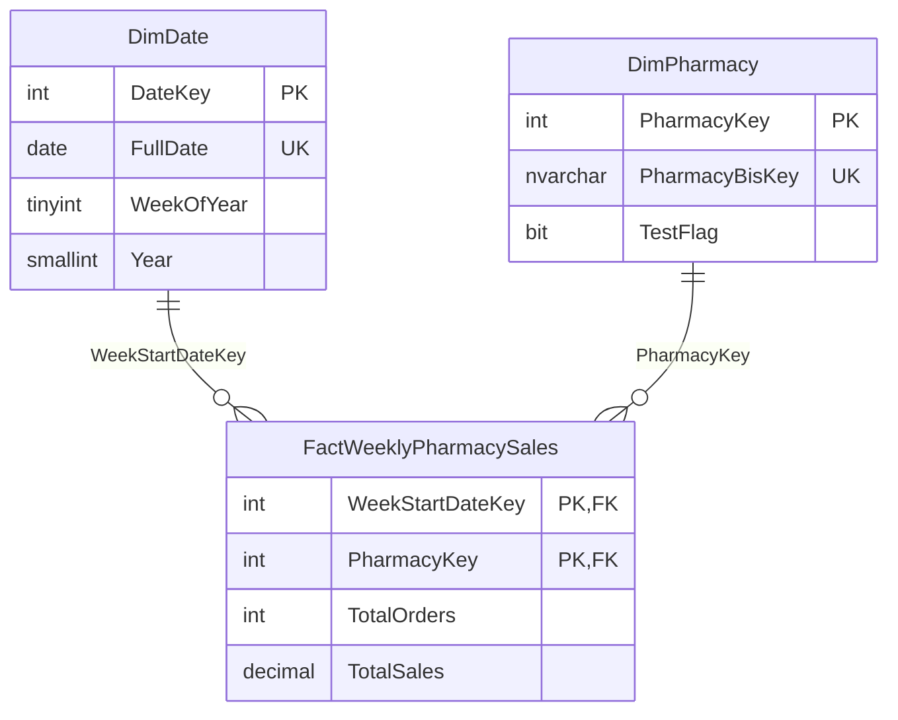

# Dimensional star model

```mermaid
erDiagram
  DimDate ||--o{ FactWeeklyPharmacySales : "WeekStartDateKey"
  DimPharmacy ||--o{ FactWeeklyPharmacySales : "PharmacyKey"
  DimDate {
    int DateKey PK
    date FullDate UK
    tinyint WeekOfYear
    smallint Year
  }
  DimPharmacy {
    int PharmacyKey PK
    nvarchar PharmacyBisKey UK
    bit TestFlag
  }
  FactWeeklyPharmacySales {
    int WeekStartDateKey PK,FK
    int PharmacyKey PK,FK
    int TotalOrders
    decimal TotalSales
  }
```

`DimOrderStatus` is deliberately **not** included as a relationship to the fact. Filtering occurs during the pipeline, not downstream grouping. Week starts Monday.
